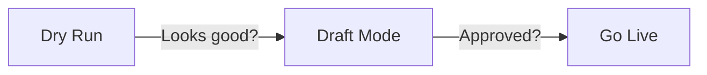

# Quick Start

**Get 1 article live TODAY.**

## 1. Prep
- Need: Anthropic API key
- Need: WP app password
- Find REST URL: `yoursite.com/wp-json/wp/v2`
- Find Category ID.

## 2. Install
```bash
mkdir ~/wp-auto && cd ~/wp-auto
python3 -m venv venv && source venv/bin/activate
pip install anthropic requests pyyaml apscheduler sqlalchemy python-dotenv
echo "ANTHROPIC_API_KEY=sk-ant-xxx" > .env
```

## 3. Test & Live



```bash
# Dry Run
python3 wp_content_engine.py --site-url "url" --rest-api "api" --username "user" --password "pass" --category-id 5 --niche "tech" --authors "Team" --dry-run

# Draft
python3 wp_content_engine.py ... --draft

# Live
python3 wp_content_engine.py ...
```

## 4. Schedule
Create `sites.yaml` (see config), then run:
```bash
nohup python3 wp_scheduler.py --config sites.yaml > scheduler.log 2>&1 &
```

## Fix Issues
- **401**: Bad app password.
- **Module missing**: `pip install ...`
- **Short article**: Narrow niche (e.g. "tech" -> "2024 VC funding").
