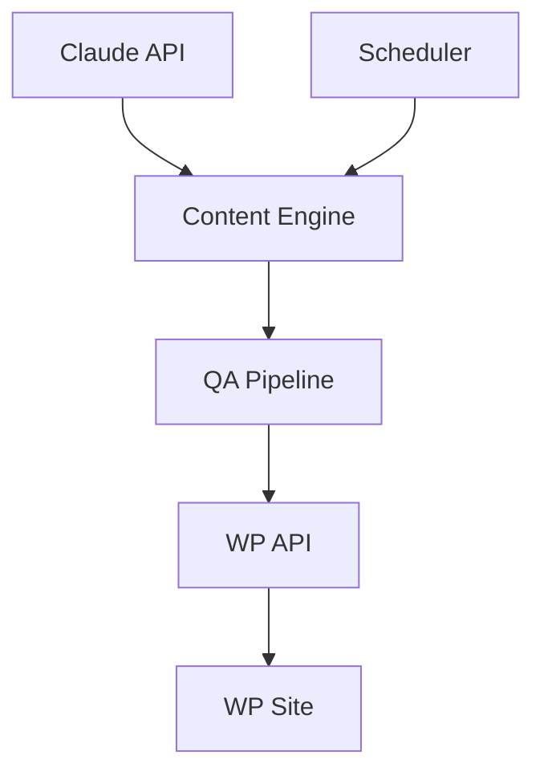

# WP Content Auto

**Bot writes. WP posts. Daily.**

## 📊 Features
- Bot write
- Multi-site
- Quality check
- Schedule
- Dashboard
- Secure

## 🚀 Quick Start
```bash
git clone <repo-url>
pip install -r requirements.txt
cp .env.example .env # add key
cp sites.yaml.example sites.yaml # add wp creds
python3 wp_content_engine.py --dry-run
```

## 🎯 Arch



## 📁 Files
- `wp_content_engine.py`: Core
- `wp_scheduler.py`: Cron
- `sites.yaml`: Config
- `monitoring_dashboard.html`: Stats
