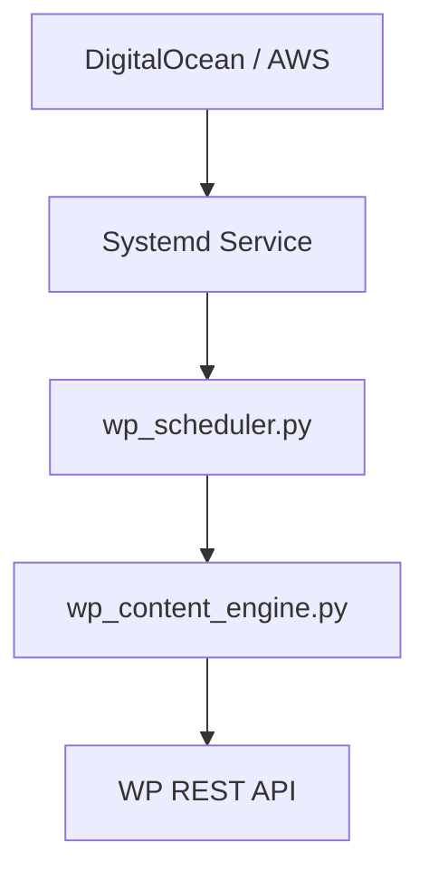

# Complete Setup

**Full guide to run 24/7.**

## 1. Environment
```bash
python3 -m venv venv && source venv/bin/activate
pip install -r requirements.txt
echo "ANTHROPIC_API_KEY=sk-ant-xxx" > .env
chmod 600 .env
```

## 2. WP Config
- Create App Password (WP Admin -> Users -> App Passwords).
- Test REST: `curl -u "user:pass" https://site.com/wp-json/wp/v2/posts`
- Get Category: `curl -u "user:pass" https://site.com/wp-json/wp/v2/categories | jq`

## 3. Deployment



### Systemd (Linux)
Create `/etc/systemd/system/wp_auto.service`:
```ini
[Unit]
Description=WP Auto
After=network.target

[Service]
Type=simple
User=root
WorkingDirectory=/path/to/wp-automation
ExecStart=/path/to/wp-automation/venv/bin/python3 wp_scheduler.py --config sites.yaml
Restart=on-failure

[Install]
WantedBy=multi-user.target
```
Run: `systemctl enable --now wp_auto`

## 4. Scale & Monitor
- **Scale**: Add more times to `publish_times` in `sites.yaml`.
- **Logs**: `tail -f wp_scheduler.log`
- **Stats**: Check `publish_results_*.jsonl`

## 5. Security
- NEVER commit `.env`.
- Use App Passwords ONLY.
- Keep `chmod 600 .env`.
