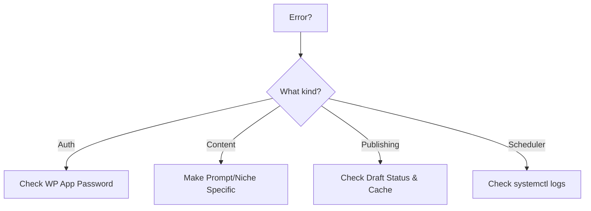

# Troubleshooting

**Quick Fixes**

## Common Issues

### API / Auth
- **401 Unauthorized**: Bad App Password or Username. Verify in WP Admin.
- **403 Forbidden**: Security plugin or IP blocked. Disable plugins to test.
- **Invalid Content-Type**: Enable JSON parsing in WP.

### Content Generation
- **Too short**: Make niche specific in `sites.yaml`. E.g., "tech" -> "2024 AI startups".
- **Claude Error**: Check quota or wait 60s for rate limit.

### Publishing
- **Doesn't appear**: Check if it's a Draft or scheduled for future. Clear WP Cache.
- **Missing image**: Verify image URL is public.

### Scheduler
- **Not running**: `systemctl status wp_auto` or `ps aux | grep wp_scheduler`
- **Missing sites.yaml**: Run from correct dir.

## Troubleshooting Tree



## Emergency Reset
```bash
sudo systemctl stop wp_auto
rm -rf venv *.log content_jobs.db
python3 -m venv venv && source venv/bin/activate
pip install -r requirements.txt
sudo systemctl start wp_auto
```
